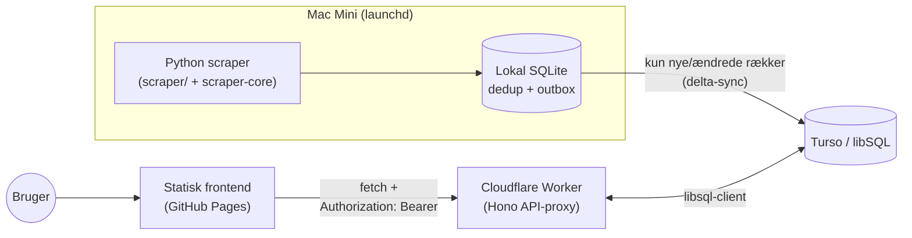

# vacuum -- sourcing til SHV-projektet (Slotsherrensvej 139)

**Scope udvidet 2026-10-03:** "vacuum" startede som en ren sikkerhedsstøvsuger-
scraper, men dækker nu sourcing af materialer og udstyr til hele SHV-projektet
(totalrenovering af et tidligere bageri, Slotsherrensvej 139) -- døre,
brandvinduer (BD60), genbrugs-byggematerialer m.fl. er under opbygning som
nye kategorier. Se `scraper/scraper/categories.py`'s docstring for arkitekturen
(hver kategori har sin egen normalize/classify-logik, men deler al scraping-/
sync-infrastruktur), og `.claude/agents/stoevsuger-ekspert.md` for hvordan
den oprindelige sikkerhedsstøvsuger-ekspertise er bevaret som sin egen,
dedikerede subagent i stedet for at blive udvandet i det bredere scope.

Den oprindelige, fuldt implementerede kategori overvåger brugtmarkeder for
byggestøvsugere i støvklasse H (primært) og M (sekundært, kun spec-godkendte
modeller), der lovligt og teknisk kan bruges til kvartsstøv og asbestholdigt
støv ved privat renovering i Danmark. Bygget på `fddigi/scraper-boilerplate`
(se resten af denne fil for skabelonens generelle dokumentation) -- denne
sektion dækker kun det projektspecifikke.

## Kilder

| Kilde | Status | Note |
|---|---|---|
| dba.dk | ✅ Aktiv | Playwright, Schibsted-platform |
| guloggratis.dk | ✅ Aktiv | Playwright, egen React-DOM |
| kleinanzeigen.de | ✅ Aktiv, live-verificeret | Playwright, frisk context pr. forespørgsel -- selectors fuldt genskrevet efter site-redesign, se nedenfor |
| blocket.se | ✅ Aktiv, live-verificeret | Samme Schibsted-platform som dba.dk, ingen ændringer nødvendige |
| vinted.dk | ❌ Deaktiveret 2026-09-29 | API-endpointet giver 404 på alt, bekræftet live -- en Playwright-omvej virker teknisk, men udbuddet er forbrugerstøvsugere/tilbehør, intet industri-H-klasse. Se `sources/vinted.py`'s docstring |
| klaravik.dk | ✅ Aktiv | Auktion, aktuelt bud (ikke fast pris). Får et kildespecifikt ekstra søgeord ("støvsuger"), se `search_terms.per_source` i config.yaml |
| auktionshuset.dk ("dab.dk" i specen) | ✅ Aktiv, **stærkeste fund ved test** | Konkurs-/overskudsauktioner -- reelt lager af professionelt udstyr. Samme kildespecifikke supplement som klaravik |
| retrade.eu | ✅ Aktiv, **lavt forventet udbytte** | Domineret af tung entreprenørmaskineri. En DKK-only prisparser-bug (rettet 2026-09-29) droppede tidligere ~2/3 af alle kort tavst -- se `sources/retrade.py`'s docstring |
| Facebook Marketplace | ✅ Aktiv (genoptaget 2026-09-30) | Kræver en logget-ind session (FACEBOOK_C_USER/FACEBOOK_XS i .env, git-ignoreret) fra en DEDIKERET konto -- ikke brugerens primære. Imod Metas ToS at automatisere; sessionen kan spærres uden varsel. Se `sources/facebook.py`'s docstring for den fulde risikomodel |
| eBay Browse API, Tradera Open Platform | ❌ Udeladt | Kræver egen gratis developer-registrering (developer.ebay.com / Tradera) -- ikke oprettet endnu |
| campenauktioner.dk | ❌ Udeladt | Midlertidigt utilgængelig ved research ("opdatering") -- prøv igen senere |
| nettoauktion.dk | ❌ Droppet | Domænet findes ikke i praksis |

## Kritiske fund fra live-test (2026-09-19)

Flere reelle bugs blev fundet og rettet ved at teste mod de faktiske,
levende markedspladser (ikke kun syntetiske unit-tests):

- **Falsk bot-wall på auktionshuset.dk**: en "captcha"-tekstmarkør udløste
  fejlagtigt bot-wall-detektion, fordi siden permanent indlejrer et
  reCAPTCHA-script til login-formularen, uafhængigt af søgeresultatet.
  Markøren tjekkes nu kun ved 0 fundne kort, og "captcha" er droppet helt fra
  denne kildes markørliste.
- **guloggratis.dk filtrerede ALLE rigtige annoncer fra**: en off-by-one i
  href-slash-tælling (`<= 3` i stedet for `<= 2`) betød at ingen ægte annoncer
  nogensinde blev godkendt.
- **klaravik.dk filtrerede ALLE annoncer fra som "afsluttede"**: siden
  renderer status-tags (afsluttet/reservepris) i DOM'et for hvert kort
  samtidig, uanset faktisk status -- kun CSS skjuler de irrelevante. Rettet
  til at bruge `.is_visible()` i stedet for blot elementets tilstedeværelse.
- **For aggressiv "kun svag evidens"-afvisning**: rigtige Nilfisk
  Attix-annoncer med et modelnummer models.py ikke dækker (fx "Attix 751-11")
  blev automatisk afvist, fordi ordet "industristøvsuger" indgår i teksten.
  Et kendt mærke nedgraderer nu til "se nærmere" (bed om typeskilt) i stedet.
- **Fejlplaceret blacklist-mønster**: `karcher_wd_serie` manglede
  mærke-kontekst og ramte en Nilfisk-annonce ved et uheld.
- **kleinanzeigen.de var fuldt ude af drift**: sitet er redesignet siden
  PASPEAKERS byggede sin scraper (`article.aditem` findes ikke længere).
  Herudover blokerer en obligatorisk GDPR-cookie-væg AL rendering på hver
  frisk browser-context, indtil den klikkes væk. Begge dele rettet
  (nye selectors + eksplicit klik), samt en tredje fejl: søgeord med "/"
  (fx "NT 35/1") knækkede URL-stien og gav 50 helt urelaterede fund (biler,
  lejligheder) i stedet for en fejl -- rettet ved at erstatte "/" med "-".
  Efter alle tre rettelser: fandt bl.a. "Kärcher NT 35/1 Tact Te H" til 549
  kr., den model specen selv kalder "bedste brugtjagt".
- **vinted.dk's API-endpoint svarer nu 404**: PLAGGs research (2026-07-10)
  bekræftede det virkede anonymt; ved test 2026-09-19 er det enten
  flyttet/omdøbt eller blokeret af sitets nu-indlejrede DataDome-script.
  Kilden fejler gracefult, men leverer p.t. ingen reelle fund -- kræver et
  nyt research-spike med frisk netværks-interception.

Se git-historikken/kommentarerne i `scraper/scraper/sources/*.py` og
`scraper/scraper/models.py` for de fulde begrundelser.

## Kritisk Opus 5-gennemgang af søgeresultater vs. opdrag (2026-09-20)

Brugeren bad om en dybdegående, kritisk sammenligning af de faktiske
søgeresultater mod det oprindelige opdrag, fordi for meget irrelevant fandt
igennem. To strukturelle fund forklarede det meste:

- **Produktionen kørte kun 3 søgeord, ikke de ~53 i `config.yaml`.**
  `search_terms.py` seedede Turso ÉN gang ved første kørsel og læste aldrig
  config.yaml igen -- en tidlig ad-hoc smoke-test-kørsel med kun 3 termer
  låste dem permanent fast. Rettet: `load_search_terms()` sikrer nu ALTID
  (idempotent, hver kørsel) at config.yaml's termer findes i Turso, uden at
  røre allerede-eksisterende (inkl. bevidst deaktiverede) termer.
- **Stale rækker blev aldrig genklassificeret.** `pipeline.py` sprang tidligere
  tilbehørs-/udlejningsannoncer helt over (`continue` FØR normalisering) --
  en allerede-gemt rækkes GAMLE vurdering forblev synlig for evigt, uanset
  senere filter-forbedringer. Rettet: rækken normaliseres og SKRIVES altid,
  med en direkte "afvis"-dom for tilbehør, så fremtidige regel-ændringer
  automatisk retter allerede-scrapede rækker ved næste besøg.

Kvantificeret støjniveau i en stikprøve (87 rækker, kun 3 søgeord): af 25
ikke-afviste fund var kun 3 (12%) reelt plausible H/M-maskiner. Konkrete
rettelser i `models.py`/`normalize.py`/`classify.py`:

- **Nilfisk Attix/Alto uden klassebogstav** (44% af al støj i stikprøven,
  fx "Attix 50-21", "ATTIX 751-11") hård-afvises nu -- Attix-seriens
  variant-tal ender på -0H/-2H (H) eller -2M (M), mens -01/-11/-21/-51 er
  ingen klasse, præcis den fælde opdraget selv nævner.
- **Kärcher NT uden klassebogstav** generaliseret (dækkede kun "NT 35/1"/
  "NT 30/1", missede "NT 45/1", "NT 30/1 Wet & Dry" -- opdragets egen
  "mest udbudte maskine overhovedet").
- **Stavefejl-tolerant Attix-genkendelse** ("Atto", "Attixx", "attik" set
  i rigtige annoncer) -- lukkede 2 ægte fund ind der ellers gik tabt.
  **Ronda H-serie** generaliseret fra kun "2800 H" til hele serien (fandt
  "RONDA 80H", "RONDA 1800H").
- **Titel-scoped tilbehørsfilter** (poser/børste/dyse/slangesæt/mundstykke)
  adskilt fra det brede tekstfilter, så en hel maskine der blot NÆVNER
  medfølgende poser i beskrivelsen ikke rammes fejlagtigt.
- **`known_brand_mentioned`-fribilletten** kræver nu OGSÅ et modelnummer-
  agtigt tal -- "Bosch støvsuger"/"Nilfisk støvsuger" (intet at verificere)
  afvises nu i stedet for at få en gratis "se nærmere".
- **Prisregler rettet** (se også brugerens eget "billigst forsvarligt"-
  eksempel, Metabo ASA 30 H PC): 70%-af-nypris-tjekket bruger nu selve
  UDBUDSPRISEN, ikke pris+filterestimat (ellers kunne en lav-nypris-model
  aldrig bestå selv en fair brugt-pris), og springes helt over for en
  bekræftet fabriksny/ubrugt maskine (reglen forudsætter slid på en BRUGT
  maskine -- en kategorifejl at anvende på en ny).
- **`valideret`-filter** (ny, Opus 5-anbefaling): en UAFHÆNGIG akse fra
  vurdering -- "er støvklassen bekræftet via et faktisk modelnavn?", ikke
  "er det et godt køb?". Beregnet ved query-tid i Worker'en (som
  `forhandlingsmulighed`), ikke i Python, netop for at undgå samme
  stale-data-problem som ovenfor. Tilgængelig som `?validated=1` og en
  "Kun validerede"-tjekboks i frontend'en.
- **M-klasse-søgeord fjernet** (brugeren har afklaret at kun H reelt har
  interesse i praksis): 25 M-termer brugte ~1/3 af søgebudgettet og fandt
  præcis 1 M-annonce i hele datasættet. M-modellerne er STADIG i
  `MODEL_WHITELIST` (disambiguering/blacklist-funktion), blot ikke aktivt
  opsøgt. Frontend'en filtrerer nu som standard til kun H-klasse, med et
  eksplicit "Alle klasser"-valg for at se M igen.
- **Watchdog-timeout udvidet** (900s, alle Playwright-kilder): efter
  search_terms-reseed-fixet ovenfor voksede en fuld kørsel fra 3 til ~53
  termer, hvilket overskred det gamle 300s-budget -- konkret observeret:
  en hel kørsels resultater gik tabt, fordi den underliggende fetch-tråd
  ikke kan afbrydes (se `main.py`'s kommentar), kun opgives af watchdog'en.

**Efter en fuld kørsel med alle ovenstående fixes** (1.049 rå fund, 8
kilder, alle 53 søgetermer) fandt en ny Opus 5-gennemgang af de FAKTISKE
resultater 19 filterpose-/filtersæk-reservedelsannoncer der stadig lækkede
igennem (fx "Sicherheitsfiltersack für Attix 30-0H PC", "Bosch GAS 35 H AFC
8x PE-Säcke") -- to af dem endda vist som "✓ valideret". To uafhængige
årsager, begge rettet:
- `is_accessory_title()` lod et modelmatch i titlen (reelt en
  kompatibilitets-reference for reservedelen, "...für Attix 30-0H PC")
  overtrumfe tilbehørs-signalet. Rettet med et pakke-/styktal-mønster
  ("5er Pack", "8x") og et "til/für/passend für"-mønster der vinder
  uanset modelmatch.
- Selv når tilbehør korrekt blev detekteret, nulstillede `pipeline.py` kun
  `vurdering`, ikke `model_key`/`dust_class`/`klasse_kilde` -- netop de
  felter `valideret` beregnes fra. Rettet til også at nulstille disse ved
  tilbehørs-override.
De 19 allerede-scrapede rækker er patchet direkte i Turso (ingen grund til
en ny 1-times fuld kørsel for 19 kendte rækker); fremtidige kørsler retter
det automatisk via samme "altid genberegn, aldrig skip" mekanisme som R10.

## Version 3 af brugerens modeloversigt (2026-09-29) -- asbest-påstande rettet

Brugeren afleverede `input/stovsuger-modeloversigt2.md`, en eksplicit
selvkorrigerende revision af de to tidligere versioner (dens afsnit 9 er en
changelog over egne fejl). Den er nu den stærkeste kilde for model-metadata.
`input/stovsuger-modeloversigt.md` (version 1-2) er **beholdt som historisk
dokument**, men dens tilbagetrukne påstande må ikke genciteres i ny kode.

**Det centrale fund (afsnit 7A).** Sætningen *"Dust class M and H certification
including Asbestos"* på Nilfisks egen produktside er **serietekst for hele 33
M/H-familien** -- den står ordret også på siden for **ATTIX 33-2M PC** (varenr.
107412179), en M-maskine der ikke må bruges til asbest. Version 1-2 brugte
sætningen som *stærkeste* bevis for at Nilfisk Attix 33-2H er asbestgodkendt.
Det holder ikke. Det der holder, er SKU-specifikt: **"ASBES" i varenavnet på
107412183** (PC) og **"BG BAU ASBEST" på 107419012** -- en *anden, sjældnere*
IC-SKU end den "almindelige" IC 107412184, som ingen mærkning har.

Konsekvenser i koden:

- **`nilfisk_attix_33_2h` har nu `asbestos_approved=None`** (ukendt), ikke
  `True`. Et bart "Attix 33-2H"-tekstmatch kan ikke skelne de tre varenumre.
  Feltet er sat via en ny `inherit_brand_asbestos_default=False`, fordi
  `asbestos_approved=None` alene ikke kan udtrykke "eksplicit ukendt" --
  `__post_init__` ville ellers opgradere det til `True` via
  `_ASBESTOS_APPROVED_H_BRANDS`.
- **Ingen model_key-opdeling på IC/PC.** Den ville være falsk præcision: både
  den mærkede 107419012 og den umærkede 107412184 er "IC". Mærkningen er
  fritekst i annoncen, ikke noget der kan udledes af modelnavnet, og opsamles
  derfor som et **blødt tekst-signal**, `asbest_sku_maerkning`
  (`normalize.ASBESTOS_SKU_MARKING_PATTERN`, samme mekanik som
  `nyt_filter`/`unused_machine`): varenumrene, `"BG BAU"`, og `"ASBES"` **uden**
  efterfølgende `t` (varenavnets afkortede stavemåde). Ordet *"asbest"* alene
  er bevidst **ikke** med -- det dækker både sælgerens marketingpåstand og det
  stik modsatte, at maskinen *har kørt* asbest (-3 point).
- **Scoringen skelner nu tre niveauer** i stedet for at give alle +3:
  modelbevis (+3) > SKU-mærkning i annonceteksten (+3) > sælgerens egen,
  ukvalificerede påstand (+1). Påstår en annonce asbestgodkendelse uden at
  models.py kan bekræfte den og uden SKU-mærkning, tilføjes en `mangler_info`
  om netop serietekst-fælden. Et **syvende sælgerspørgsmål** er tilføjet:
  varenummeret på typeskiltet.

**Øvrige rettelser fra samme dokument:**

| Model | Rettelse | Kilde |
|---|---|---|
| Nilfisk Attix 44-2H IC | `container_l` 44 → **37 l** ("44" er ikke beholderen) | 7A |
| Hilti VC 40H-X | `container_l` 30 → **36 l** | 7C |
| Nilfisk Attix 33-2H | nypris 6.100-8.500 → **4.999-5.150 kr.** | 7A |
| Nilfisk AERO 26-2H PC | nypris 3.100-3.500 → **2.569-4.269 kr.** (dokumenteret EAN-spredning) | 12 |
| Baier BSS 608H | **ny model** (30 l, H), `asbestos_approved=None`, ★★ | 5, 7A, 11 |
| Attix 30-2M/33-2M/44-2M/50-2M, Flex VCE 44 M AC, Makita VC3211M | **nye/udvidede M-mønstre** (krævede før "PC", fangede ikke IC-varianterne) | 6, 10, 11 |
| Makita VC3211L, Baier BSS 606L, RONDA 200/2000 uden H | **nye hård-afvisninger** | 10, 11 |
| Makita VC3211H | bekræftet uændret: 32 l, gråzone, ikke forbudt | 6, 7C |
| RONDA 200H | 14 l pose / 16 l beholder -- `container_l` forbliver `None` (generisk mønster dækker 80H/200H/1800H) | 7A, rettelse 17 |

`Baier BSS 608H` står i afsnit 7A, hvis overskrift lover *"dokumenteret
asbestegnethed og sikkerhedspose"* -- men modellens **egen række har
"Sikkerhedspose: *ikke fundet*"**, og der citeres intet model-specifikt
asbestbevis. Tabelplacering er ikke evidens, så den fik `None` og ★★, ikke ★★★.

**Prisloft-hul lukket.** Specens to H-intervaller (25-35 l og 40-75 l) efterlod
et hul på 36-39 l, som var tomt indtil volumen-rettelserne ovenfor flyttede to
modeller derind. Uden en rettelse ville de hverken kunne afvises på prisloft
eller blive "køb nu". `classify._price_category()` bruger nu `25 <= l < 40` for
kompakt -- hullet lukkes *opad*, mod det **laveste** købsloft (3.500 vs. 5.000
kr.), altså den konservative retning.

**Tilbagetrukne påstande (må ikke genciteres).** AERO'ens værktøjsstik begrænset
til 1100 W (udokumenteret); Nilfisk som *"dokumenteret"* OEM-producent for
Makita/Flex/Eibenstock (kilden var et værktøjsforum -- nedgraderet til
hypotese); den gamle kr./l-metode (dobbelttælling af 85 %-fyldningsgraden); og
støvklasse L/M angivet som ≤1 % / ≤0,1 % -- det var **filterelementets**
retention. De korrekte tærskler (IEC 60335-2-69 Annex AA) er **L <5 %, M <0,5 %,
H <0,005 %**. Ingen af dem var kodet i `models.py`/`README.md`, så der var intet
at fjerne -- de er noteret i `models.py`'s docstring, så de ikke genopstår.

**Åbent spørgsmål, bevidst ikke afgjort.** Serietekst-fundet undergraver strengt
taget også grundlaget for de **øvrige** Nilfisk-Attix-H-modellers
`asbestos_approved=True`, som stammer fra brand-defaulten og ikke fra nogen
SKU-specifik mærkning. Version 3 lader dem dog stå i afsnit 7A's tabel og retter
eksplicit kun 33-2H-familien (rettelse 8 og 9). Brand-defaulten er derfor
uændret; en bredere nedgradering kræver brugerens beslutning.

## Bredere indtag + egen datavalidering (2026-09-29, Opus 5-review)

Brugerens opdrag: *"For alle datakilder bør vi ved indtag løsne kravet om
kendte mærker uden modelnummer -- der vil sjældent eller aldrig være match på
vores nuværende søgestrenge. Og så skal vi bygge vores egen datavalidering i
vores ende. Få Opus til at foreslå en række metoder og teste hvad der giver
resultater. Én metode kunne fx være at søge efter H i modelnavnet."*

Alle tal herunder er **målt**, ikke estimeret: korpusset er 808 rigtige
annoncetitler -- 707 live-rækker hentet fra Turso via Worker-API'et plus 101
friske fund fra brede probe-søgninger kørt direkte mod klaravik.dk,
auktionshuset.dk, dba.dk og retrade.eu samme dag.

### Det strukturelle fund, der rammer alle metoder: der er ingen beskrivelse

**Samtlige otte kilder sætter `"description": ""`.** Hele klassifikationen --
model, støvklasse, tilbehørsfilter, bløde signaler, scoring -- hviler på
annoncens TITEL alene. Det er ikke dokumenteret nogen steder og er den enkelt
vigtigste begrænsning på hvad en valideringsmetode overhovedet kan udrette.
To af brugerens foreslåede metoder falder direkte på det (se tabellen), og
`has_model_token()`s spec-stripning er i praksis langt hårdere end tiltænkt,
fordi den arbejder på 5-10 ord i stedet for et helt annoncekorpus.

### De testede metoder

| # | Metode | Målt resultat | Dom |
|---|---|---|---|
| 1a | Brugerens eget forslag råt: `\b\d{2,4}\s*-?\s*[HM]\b` | 30 fund, **14 reelle (47 %)** | Afvist alene |
| 1b | Samme + krav om ordet "støvsuger" i titlen | 4 fund -- dræbte 10 af de 14 ægte | Afvist |
| **1c** | **Klassebogstav (suffiks ELLER fritstående) + bredt domæne-anker** | **31 fund, 30 reelle (97 %)** | **Implementeret** |
| 2 | Container/volumen + industri-ordforråd | 5 fund på 808, ingen diskriminerende kraft | Afvist |
| **2b** | **Industri-/byggestøvsuger-kategoriord, flersproget** | **23 fund, ~10 reelle** | **Implementeret (trin 4)** |
| 3 | Watt/vægt-heuristik | 6 fund, heraf `1300w bil dammsugare` og `Siemens dammsugare 1800W` | Afvist |
| **4** | **Prisbund på det svageste trin** | Fjerner 5 af 6 støj-fund, koster 0 ægte | **Implementeret** |
| 5 | Kilde-leveret kategori/brødkrumme | Ingen af de otte kilder opsamler den i dag | Ikke muligt uden ny scraping-kode |
| 6 | Spec-tæthed i beskrivelsen | 4 fund på 808 titler, ét var en askestøvsuger | Afvist (kræver beskrivelser) |
| **7a** | **Asbest-/sikkerhedssuger-ordforråd** (egen tilføjelse) | **3 af 3 fund reelle** | **Implementeret (trin 1)** |
| **7b** | **"H-klasse"-ordstillingen** (egen tilføjelse) | **10 af 10 fund reelle** | **Implementeret** |

**Metode 1's fejltilstand, konkret.** Al støjen fra det rå mønster var tyske
annoncer hvor H betyder noget helt andet: dækkenes **hastighedsindeks**
(`205/55R16 91H`, `225/50 R17 98H`, `265/60 R18 110H` -- fem forskellige
Mercedes-hjulsæt), `Motorradanhänger mieten 24H` (timer),
`Mercedes-Benz 380 SEC 126 H-Kennzeichen` (tysk veteranplade) og
`Topforstærker, Blackheart BH 100 H` (et guitarforstærker-**Head**).
Domæne-ankeret fjernede samtlige elleve uden at koste en eneste ægte maskine.
Det ene resterende falske fund (`Absaugadapter ... Metabo KGS 254 M`, hvor 254
er en savklinges diameter) lukkes i stedet af `ACCESSORY_TITLE_PATTERN`.

**Metode 3's fejltilstand.** Præmissen -- at husholdningsstøvsugere kører
lavere effekt -- holder ikke: de husholdningsmaskiner der overhovedet oplyser
watt i titlen ligger på 1.300-2.000 W, altså præcis samme interval som
industrimaskinerne.

### Fire uafhængige fejl fundet undervejs

1. **`_SPEC_UNIT_PATTERN` åd støvklasse M.** Det bare `m` var tænkt som
   "meter", men af 11 titler med `\d+ m` brugte **ingen** det som længde --
   otte var M-klasse-modelsuffikser. Konkret konsekvens: `Hilti VC 60 M-X`
   (ægte M-maskine, 6.230 kr. på blocket.se) fik strippet sit eneste
   modelnummer og blev afvist som "intet identificerbart signal".
2. **`WEAK_EVIDENCE_PATTERN` kunne ikke matche dansk flertal.**
   `industristøvsuger` stod med afsluttende `\b` og ramte derfor ikke
   `IndustristøvsugerE` -- netop formen i brugerens eget Klaravik-eksempel.
3. **Mønstrene var kun danske.** Otte rigtige tyske/svenske annoncer
   (`Bosch Asbest-Sauger Industriestaubsauger`, `Nilfisk industridammsugare
   med slang`, `Werkstattsauger Starmix ISP iPulse ARH-1635 Staubklasse H`)
   havde intet signal overhovedet, alene på grund af sproget.
4. **"H-klasse" blev slet ikke læst.** `EXPLICIT_CLASS_PATTERN` krævede ordet
   *klasse* FØR bogstavet, så den omvendte -- og mindst lige så almindelige --
   ordstilling gik tabt. Den nye gren kræver domæne-ankeret, fordi
   `<bogstav>-Klasse` også er den tyske BILserie-betegnelse.

### Kandidat-stigen erstatter den binære port

Den gamle mekanik var **én** port: `known_brand_mentioned` (= kendt mærke
**og** et modelnummer-agtigt tal). Porten blev indført bevidst 2026-09-20
efter brugerens egen manuelle diskvalifikation af "Bosch støvsuger"/"Nilfisk
støvsuger", og den er derfor **ikke slået fra** -- den er bevaret som trin 3 i
en stige med fire trin (se `classify._kandidat_signal()`). Trinnet skrives i
`classification_method`, så det altid kan ses hvilken regel der lukkede en
annonce ind, og et enkelt trin kan strammes igen uden at røre de andre.

`vurdering` er bevidst **ikke** udvidet med en fjerde værdi: husets etablerede
mønster for en ny akse er `valideret` (beregnet i Worker'en, uafhængig af
vurdering), og en ny vurdering ville kræve frontend-dropdown, badge-farve og
en ændret `?vurdering=`-semantik for et signal der allerede kan aflæses i
audit-feltet.

**Målt effekt på de 707 live-rækker:** 10 annoncer går fra `afvis` til `se
nærmere`, og alle ti er reelle kandidater -- bl.a. `Asbestsauger` (1.119 kr.),
`Bosch Asbest-Sauger Industriestaubsauger` (2.798 kr.), `Starmix H tør og våd
støvsuger` (1.500 kr.) og `Hilti VC 60 M-X` (6.230 kr.). Yderligere fire får
for første gang en støvklasse tildelt fra annonceteksten (`RONDA 40 HEPA
H-KLASSE`, `NUMATIC Rygstøvsuger RHB150NX H-klasse`, `Festool CTH 26
dammsugare (H-klass)`, `NILFISK VHS010 EX Sicherheitssauger H Klasse`).
Ingen af den støj porten oprindeligt blev bygget imod kommer tilbage.

### Indtag: hybrid, ikke global breddesøgning

Søgeordene har hidtil været **fuldstændig globale** -- `main.py` gav samme
flade liste til alle otte kilder. Live-målingerne peger på tre forskellige
svar, ikke ét:

- **Globalt tilføjet** (produktivt overalt, lav støj): ét-ords
  kategori-substantiver. `industristøvsuger` gav 53 træf på dba.dk -- det
  mest produktive enkeltord overhovedet, med bl.a. `Hilti VC 20H-X`,
  `RONDA 80H 25` og `Bygma ISC H-163 Safe` -- og det stod slet ikke i listen
  i forvejen. Plus `Industriesauger`, `industridammsugare` og det bare
  `Sicherheitssauger` (strengt bredere end den eksisterende trevorsfrase
  "Sicherheitssauger Klasse H").
- **Per kilde** (ny mekanik, `search_terms.per_source` +
  `search_terms.config_for_source()`): det bare `støvsuger` til **kun**
  klaravik og auktionshuset. Klaravik fandt 0 træf på `sikkerhedsstøvsuger`
  og 0 på `Nilfisk Attix 33-2H`, men 1 på `støvsuger` -- og det ene træf var
  præcis brugerens efterlyste annonce. Auktionshuset gav 31 lots på samme
  ord. Mekanikken kræver **ingen** ændring i nogen `sources/*.py`: alle otte
  læser allerede `primary + secondary`, så supplementet lægges i `secondary`
  for den ene kilde. Supplementer seedes aldrig til Turso's globale
  `search_terms`-tabel.
- **Bevidst ikke tilføjet:** bare mærkenavne. `Nilfisk` gav 54 træf på dba.dk
  med **nul** H-klasse-maskiner (højtryksrensere, vinduespudsere,
  Buddy/One/Elite-husholdningsstøvsugere) og 5 på klaravik.dk, også nul
  relevante. Mærkeord er den dyreste og mindst præcise breddesøgning der
  findes i denne kategori.

**retrade.eu bør formentlig deaktiveres.** Seks brede termer tilsammen gav
ÉT træf (fejemaskinen `Nilfisk City Ranger 3500`), og 0 på både `støvsuger` og
`dammsugare`. Kilden har intet udbud i kategorien, så bredere søgning kan ikke
hjælpe -- den koster kun søgebudget. Ikke slået fra her, da det er brugerens
beslutning (samme slags valg som vinted).

## Kendte begrænsninger (bevidst ikke bygget i denne omgang)

- **Ingen notifikationer/dagsrapport**: specen beder om "underret straks ved
  køb nu" og "dagsrapport kl. 07:00" -- boilerplaten har ingen push-/mail-/
  webhook-mekanisme indbygget (kun webapp-visning). Kræver et valg af kanal
  (mail? Slack/Discord-webhook? push?) før det kan bygges.
- **`afstand_km` er ikke implementeret** (kræver geokodning af sælgers
  lokationstekst mod en fast radius) -- `lokation` vises, men ikke afstand.
- **Ingen kilde opsamler en beskrivelse** (`"description": ""` i alle otte
  `sources/*.py`) og ingen opsamler kategori/brødkrumme. Alt klassificeres på
  titlen alene. Det blokerer konkret for spec-tæthedsmetoder og for
  kilde-kategori-signaler (se Opus-reviewet 2026-09-29) og er den mest
  oplagte næste investering, hvis valideringen skal videre.
- **Model-whitelisten er ikke udtømmende** (spec selv erkender dette i sektion
  2.6, "verificér typeskilt") -- ukendte modelnumre fra kendte mærker
  (Nilfisk/Kärcher/Festool/Flex/Starmix/Metabo/Bosch/...) surfacer som "se
  nærmere" med en note om at bede om typeskiltet, i stedet for at blive
  droppet eller fejlagtigt godkendt.
- **`filter_replacement_estimate_dkk` (800 kr.) og "70%-af-nypris"-tolkningen**
  er egne, dokumenterede antagelser lagt oven på specens tekst -- se
  `scraper/scraper/classify.py`'s docstring, justér i `config.yaml` hvis de
  virker forkerte i praksis.

## Lokal opstart

```bash
make venv
make test              # 54 unit-tests: model-whitelist/blacklist, scoring-motor
.venv/bin/python -m scraper.main --source dba   # kør én kilde manuelt
make install-launchd SCRAPE_INTERVAL_SECONDS=21600   # spec: "kør hver 6. time"
```

---

# scraper-boilerplate

Skabelon-repo (tænkt som GitHub "template repository") for mønsteret:

**Python-scraper på en Mac Mini (launchd) → lokal SQLite → delta-sync til Turso/libSQL
→ Cloudflare Worker (API-proxy) → statisk vanilla HTML/JS-frontend på GitHub Pages.**

Bygget fordi mønsteret var håndrullet tre gange med inkonsistent secrets-håndtering,
manuel provisionering og kosmetisk client-side "auth". Formålet er at et nyt projekt
i praksis kun kræver: "Use this template", ét bootstrap-workflow, ét CLI-kald for at
oprette den første bruger, og `make install-launchd` på Mac'en.

## Arkitektur



Nøgleprincipper:
- **Delta-writes, aldrig fuld-tabel-rewrites.** Dedup/"seen"-logik holdes lokalt i
  SQLite; kun nye/ændrede rækker sendes til Turso, i en batch pr. kørsel.
- **Én Worker pr. projekt**, ikke én pr. bruger. Auth er et `Authorization: Bearer`-
  token i `localStorage`, IKKE en cookie og IKKE en delt API-nøgle i frontend-JS.
  Cookie-baseret session blev afprøvet først og fejlede reelt i Safari (ITP blokerer
  alle third-party-cookies uanset `SameSite`, da frontend og Worker ligger på
  forskellige domæner) — se `worker/src/middleware.ts`s kommentar og
  `SCRAPING_LESSONS.md`.
- **Ingen håndrullet HTTP** mod Tursos `/v2/pipeline` - altid den officielle
  `libsql-client`-SDK (Python og TypeScript), altid parameterbinding.
- **Alt er variabelt via `.env`/secrets** - ingen hemmeligheder i kode, YAML eller
  `wrangler.toml`.

## Repo-struktur

```
scraper/                  Python-scraper for DETTE projekt (dummy-eksempel inkluderet)
packages/scraper-core/    Delt, separat pip-installérbar pakke (se dens egen README)
worker/                   Cloudflare Worker (Hono, TypeScript) - API-proxy + auth
frontend/                 Statisk vanilla HTML/JS (login + data-visning)
infra/                    provision.sh, add-user.sh, destroy.sh + delte lib-scripts
infra/launchd/            launchd .plist-template til Mac Mini'en
.github/workflows/        bootstrap.yml, deploy.yml, ci.yml
Makefile                  `make install-launchd` osv.
```

## Nyt projekt på 10 minutter

**Vigtigt, tjek FØR første bootstrap-kørsel: Organization → Settings → Actions →
General → Workflow permissions skal være sat til "Read and write permissions"**
(org-niveau, og/eller tilladt per-repo). Nogle GitHub-organisationer har som
standard/politik "Read permissions" org-bredt — det blokerer `provision.sh`s
commit-tilbage-trin med en 403 ("Resource not accessible by integration"),
uanset hvad selve workflow-filens egen `permissions:`-blok beder om. En
workflow-fil kan kun indskrænke org/repo-loftet, aldrig udvide det.
`provision.sh` fejler ikke hårdt på dette (Turso/Worker-provisionering
fortsætter), men commit-tilbage kræver rettelsen.

**Vigtigt, ÉT ENGANGS-TRIN pr. projekt: kør `./infra/finish-bootstrap-locally.sh`
lokalt, med en gang eller lige efter bootstrap.yml.** To ting kræver dette:
GitHub Pages-aktivering og repo-secrets-skrivning kan **aldrig** lykkes via
`GITHUB_TOKEN` (workflowets ephemer CI-identitet inde i `bootstrap.yml`) —
ikke fordi det mangler et permission-flag, men fordi begge er administrative
handlinger GitHub kun tillader for en rigtig, autentificeret bruger-/agent-
session, uanset hvad `permissions:`-blokken erklærer eller hvad org/repo's
"Workflow permissions" er sat til (bekræftet mod GitHubs API).

Dette er **ikke** "et menneske skal klikke i browseren" — det er "skal køre
uden for `GITHUB_TOKEN`s ephemer CI-kontekst". Enhver med en allerede-
autentificeret `gh`-session på maskinen (et menneske, eller en agent der
selv driver provisioneringen — begge virker identisk) kan bare køre scriptet
selv, uden ny credential. Bevidst IKKE løst med en gemt PAT/org-secret i
stedet: en permanent, bredere-end-`GITHUB_TOKEN`-legitimation er en dårligere
handel end en lejlighedsvis lokal kommando, for et problem der reelt kun
opstår én gang pr. projekt (se `docs/SCRAPING_LESSONS.md`).

`provision.sh` fejler ikke hårdt på nogen af de to (Turso/Worker-
provisionering fortsætter uanset), men advarer og peger på scriptet.

**Vigtigt: nye projekter skal oprettes som OFFENTLIGE repos** (`gh repo create ... --template fddigi/scraper-boilerplate --public`, IKKE `--private`). Årsag: GitHub-organisationens gratis plan tillader kun deling af organisation-level secrets med offentlige repos ("Organization secrets cannot be used by private repositories with your plan") — private repos ville se alle fire org-secrets som tomme strenge i Actions, uden nogen fejlmelding, hvilket blokerer hele bootstrap-flowet. Ingen hemmeligheder committes nogensinde i selve koden (kun `wrangler secret put`/repo-secrets), så offentlig synlighed af kildekoden er et bevidst, sikkert valg her — samme mønster som PLAGG-projektet allerede bruger.

| # | Trin | Manuel / automatisk |
|---|------|---------------------|
| 1 | Klik "Use this template" på GitHub (eller `gh repo create <navn> --template fddigi/scraper-boilerplate --public --clone`) og navngiv det nye repo | **Manuel** (klik/kommando) |
| 2 | Sæt organisation-secrets ÉN GANG for hele din GitHub-organisation: `TURSO_PLATFORM_TOKEN`, `TURSO_ORG`, `CLOUDFLARE_API_TOKEN`, `CLOUDFLARE_ACCOUNT_ID`, og valgfrit `HEALTHCHECKS_API_KEY` | **Manuel** (kun første gang, arves af alle fremtidige projekter) |
| 3 | Kør workflowet "Bootstrap new project" (Actions-fanen → workflow_dispatch) | **Manuel trigger, automatisk indhold** - opretter Turso-db, deployer Worker + secrets |
| 4 | `git clone` det nye repo lokalt / på Mac Mini'en, kør `./infra/finish-bootstrap-locally.sh` (aktiverer Pages + skriver repo-secrets — `GITHUB_TOKEN` kan aldrig gøre nogen af delene, se boks ovenfor) | **Manuel kald, lokalt, idempotent** |
| 5 | `cp .env.example .env`, kør `./infra/local-turso-env.sh --write` (kræver `turso auth login` — se "Lokal Turso-adgang" nedenfor) for at udfylde `TURSO_DATABASE_URL`/`TURSO_AUTH_TOKEN`, og evt. `HEALTHCHECK_URL` manuelt fra repo-secrets | **Manuel kald, automatisk udfyldning** |
| 6 | `./infra/add-user.sh` (secret-mode, default) - opretter admin-login | **Manuel kald, automatisk logik** - password vises ÉN gang |
| 7 | ~~Ret `frontend/config.js`~~ — sket automatisk i trin 3 (`provision.sh` udfylder og committer `API_BASE`) | **Automatisk** |
| 8 | `make venv && make install-launchd` på Mac Mini'en | **Manuel kald, automatisk resten** - venv, launchd-plist, `launchctl load` |
| 9 | Åbn GitHub Pages-URL'en, log ind, se data | **Manuel verifikation** |
| 10 | Fremtidige pushes til `main` deployer Worker automatisk (`deploy.yml`); Pages opdaterer sig selv fra branchen | **Automatisk** |

Alt andet (schema-migration, secrets-hygiejne, CORS-lås, rate-limiting,
delta-sync-logik) er allerede bygget ind i skabelonen - der er intet at "huske"
per projekt ud over ovenstående ni klik/kommandoer.

## Lokal Turso-adgang (`infra/local-turso-env.sh`)

Uden dette trin viser frontend'en altid en tom liste, selvom scraperen kører
fint lokalt: den lokale scraper skriver til en ANDEN Turso-forbindelse end den,
Worker'en læser fra, medmindre `.env`'s `TURSO_DATABASE_URL`/`TURSO_AUTH_TOKEN`
faktisk peger på den rigtige database.

`TURSO_AUTH_TOKEN` bliver ALDRIG logget eller gemt noget sted efter
`bootstrap.yml` har kørt - den bruges kun momentant til at sætte Worker'ens
egen secret. Det er ikke en fejl, det er write-once-by-design for en
hemmelighed. Løsningen er ikke at "finde" det oprindelige token igen, men at
mint et NYT token til lokal brug:

**Forudsætning, ÉN GANG PR. MASKINE (ikke pr. projekt):**
```bash
turso auth login   # interaktiv, åbner en browser
```

**Pr. projekt, når som helst du har brug for lokal sync:**
```bash
./infra/local-turso-env.sh           # printer TURSO_DATABASE_URL/TURSO_AUTH_TOKEN til at kopiere ind
./infra/local-turso-env.sh --write   # eller lad den selv opdatere .env
```

Bevidst IKKE baseret på `TURSO_PLATFORM_TOKEN` (org-secreten `provision.sh`
bruger til automatiseret provisionering) - det er et langt mere magtfuldt,
org-bredt token, og hører ikke hjemme i en lokal `.env`-fil pr. udvikler-
maskine. Et `turso auth login`-mintet token er personligt og til enhver tid
selvstændigt tilbagekaldeligt uden at påvirke provisioneringen af andre
projekter.

## Brugeradministration (`infra/add-user.sh`)

To modes, styret via flag:

```bash
# v1 default: sætter ADMIN_USER/ADMIN_PW_HASH som Worker-secrets.
# Workeren tjekker login direkte mod disse to secrets - `users`-tabellen
# findes fra v1, men bruges ikke i denne mode.
./infra/add-user.sh
./infra/add-user.sh --secret-mode --username admin

# Fremtidig multi-user mode: INSERT/UPDATE i `users`-tabellen i Turso.
# Kræver at Worker'ens /login-handler ombygges til et table-lookup først
# (skemaet er klar fra dag ét, men denne omlægning er bevidst ikke automatisk).
./infra/add-user.sh --table-mode alice
```

Begge modes genererer et 20-tegns kryptografisk tilfældigt password
(`openssl rand -base64 15`), hasher det med PBKDF2-HMAC-SHA256 (samme metode og
parametre som Worker'en bruger til at verificere det), og printer passwordet ÉN
gang til terminalen. Det gemmes ingen andre steder af scriptet - skriv det ned i
en password-manager med det samme.

**Password-reset** = kør scriptet igen for samme bruger. Det overskriver hashen.
Der er bevidst ingen reset-mail og ingen 2FA - det er fravalgt for hobby-skala med
én (eller nogle få) brugere; en reel reset-mail-flow ville kræve en mailudbyder og
et sikkert engangslink-system, som er overkill her.

## Nedlæggelse af et projekt (`infra/destroy.sh`)

```bash
./infra/destroy.sh          # dry-run: viser hvad der ville blive slettet
./infra/destroy.sh --yes    # sletter for alvor: Worker, KV, Turso-db (+ alle dens
                             # tokens), GitHub Pages, og de repo-secrets provision.sh skrev
```

Irreversibelt - al data i Turso-databasen forsvinder. Kør uden `--yes` først for at
se præcis hvad der ville ske.

## Lokal udvikling og test

```bash
# Python (scraper-core + dummy-scraper)
make venv
make test          # unit-tests for delta-sync (mocket Turso-klient)
make lint          # ruff

# Kør scraperen lokalt uden nogen Turso-konto (graceful fallback til lokal-only):
.venv/bin/python -m scraper.main

# Worker (Cloudflare)
cd worker
npm install
npx tsc --noEmit   # typecheck
npx vitest run     # unit-tests for password-hash / session-token-logik
npx wrangler dev    # lokal dev-server (kræver ikke live Cloudflare-deploy)

# Fejlsøger et RIGTIGT (ikke wrangler-dev) miljøs KV-indhold? `wrangler kv
# key list/get/put/delete` rammer som standard en LOKAL simuleret butik,
# ikke den rigtige Cloudflare KV, selv med et rigtigt namespace-id - tilføj
# altid --remote:
npx wrangler kv key list --namespace-id <id> --remote
```

## Secrets-hygiejne

- Al konfiguration læses fra `.env` (gitignored) via pydantic-settings.
  `.env.example` er den ene sandhedskilde for alle variabelnavne, inkl. dem der
  reelt lever som `wrangler secret` / GitHub-secrets og ikke i `.env` selv.
- `wrangler.toml` indeholder kun placeholder-værdier og kommentarer om hvilke
  `wrangler secret put`-kald der skal køres.
- `.gitleaks.toml` + `.pre-commit-config.yaml` scanner for secrets før commit;
  samme scan kører i `ci.yml`.

## Gratis tiers (ingen betalte tjenester påkrævet)

- Turso free: 100 databaser, 5 GB storage, 500M reads / 10M writes pr. måned.
- Cloudflare Workers free: 100.000 requests/dag (kontoniveau, deles på tværs af
  alle Workers på kontoen - hold det for øje hvis du kører flere projekter).
- GitHub free: ubegrænsede offentlige repos, Actions-minutter til hobby-brug, Pages.
- Healthchecks.io free (valgfrit): 20 checks - rigeligt til én pr. projekt.

## Valideret i praksis

Denne skabelon ER nu kørt ende-til-ende mod rigtige Cloudflare-, Turso- og
GitHub-konti — ikke kun syntaks-valideret. Det første rigtige projekt bygget
herpå (`pa-speakers`) fandt og rettede 25 konkrete fund undervejs, heraf flere
alvorlige (bl.a. et login-system der var 100% ødelagt i produktion pga. en
PBKDF2-iterationsgrænse ingen lokale tests fangede, og en cookie-baseret
session der virkede i Chrome men ikke Safari). Alle skabelon-niveau-fund er
rettet i denne repos historik — se `docs/SCRAPING_LESSONS.md` og commit-loggen
for detaljer. Kendte, resterende begrænsninger (dokumenteret, ikke skjulte):

- GitHub Pages-aktivering og repo-secrets-skrivning kræver begge ét lokalt
  engangs-kald (`./infra/finish-bootstrap-locally.sh`, se boks ovenfor) —
  bekræftet, hårde platformsbegrænsninger på `GITHUB_TOKEN` som CI-identitet,
  ikke noget der kan/bør automatiseres væk via en permanent, mere magtfuld
  credential i stedet.
- `make install-launchd` er valideret separat (`plutil -lint` på den genererede
  plist) men ikke kørt for alvor i selve skabelon-udviklingen — det ville
  registrere et rigtigt baggrundsjob. `pa-speakers`s eget
  `com.pa-speakers.scraper`-job (kørt via denne mekanisme) beviser mønstret
  fungerer i praksis.
- Dummy-scraperen (`scraper/scraper/sources/jsonplaceholder.py`) er kørt
  end-to-end flere gange, inkl. verifikation af at dedup virker korrekt.

### Din tur: sådan aktiverer du det for første gang

1. Push dette repo til dit eget GitHub-repo (ikke gjort af denne skabelon - intet
   remote er konfigureret).
2. Slå "Template repository" til under repoets Settings.
3. Sæt de fire (plus valgfrit `HEALTHCHECKS_API_KEY`) organisation-secrets nævnt
   i tjeklisten ovenfor, og bekræft org-niveau "Workflow permissions".
4. Opret et nyt repo fra skabelonen, kør `bootstrap.yml` (trin 3), og kør
   derefter `./infra/finish-bootstrap-locally.sh` lokalt (trin 4).

## Afvigelser fra opgavebeskrivelsen

- **Vitest kunne ikke køres direkte i dette repos egen sti** under udviklingen,
  fordi stien indeholder tegnet `#` (`.../# Claude tmux/...`), hvilket Vite
  fejlfortolker som en URL-fragment-markør. Selve testkoden er verificeret ved at
  køre den samme testsuite i en kopi af `worker/` uden på en sti uden `#` (alle 9
  tests bestod) - dette er en kvirk ved denne specifikke lokale mappe, ikke en fejl
  i koden, og vil ikke optræde i en normal GitHub Actions-checkout eller på en
  normal lokal sti.
- `Makefile` bruger bash `${var//search/replace}` i stedet for `sed 's#...#...#'`,
  og `$(shell basename "$(CURDIR)")` i stedet for `$(notdir $(CURDIR))` - begge
  fordi denne repos egen sti indeholder mellemrum og `#`, som ellers ville
  ødelægge hhv. sed's afgrænsningstegn og GNU Makes indbyggede path-funktioner
  (som splitter på whitespace). Løsningen er mere robust end den oprindelige plan
  og fungerer også på almindelige stier uden specialtegn.
